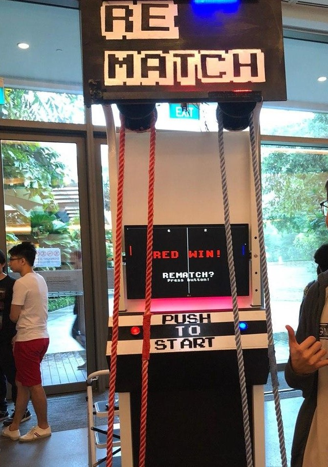
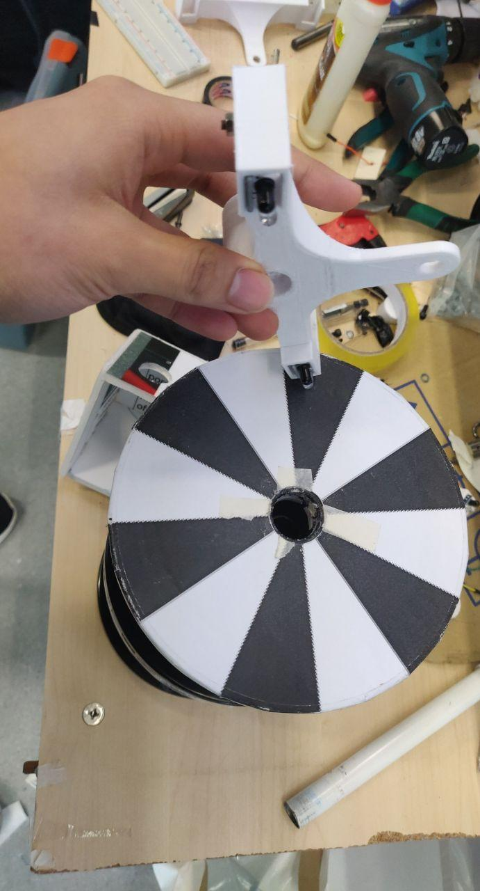
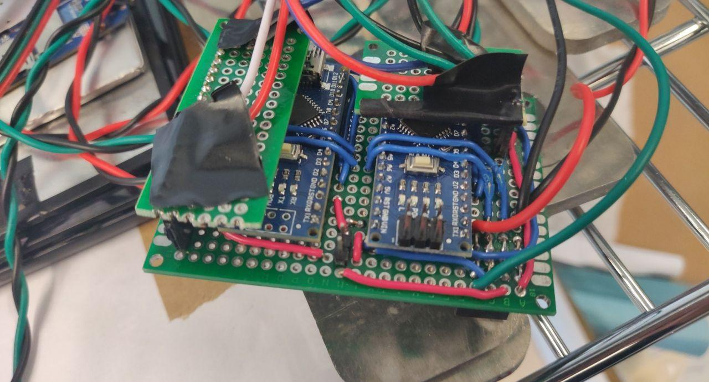

# REMATCH 
A 3.007-Introduction to Design Project featuring Pong game with pulling ropes# 3.007 F05 DESIGN TEAM 7

Authors:
 - Kevin Ma Yuchen

 - Lui Yan Le 

 - Hazel Xing Yunqing

 - Princeton Poh Jin Heng 

 - Jordan Chan 

   

## Table of Contents 
- [REMATCH](#rematch)
    - [Table of Contents](#table-of-contents)
    - [Repo Content](#repo-content)
    - [Introduction](#introduction)
        - [Poster](#poster)
        - [Video](#video)
    - [How to use](#how-to-use)
    - [Components](#components)
        - [System Diagram](#system-diagram)
        - [Electronics](#electronics)
        - [Mechanical](#mechanical)
        - [Software](#software)
    - [Trouble Shooting & FAQ](trouble-shooting-&-faq)
    - [Future improvements](#future-improvements)

## Repo Content 
- `ball.py`: ball class in pygame
- `paddle.py`: paddle class in pygame
- `main.py`: The main game script. You can run it both on a normal computer or the arcade console we made
- `i2c_encoder`: Arduino code for encoders using i2c
- `past_codes`: Things that we have have tried before but are no longer used
- `assets`: poster, .STEP files, images, and the font used in the game

## Introduction 
REMATCH is a 3.007-Introduction to Design Project by Cohort 5 Team 7 of SUTD Class of 2022. It is a arcade game console that enables people to play the classic game Pong with the motion of pulling ropes.

### Poster 
find the [poster](assets/poster.pdf) in `assets`

### Video 
https://youtu.be/wE_V6qiuwjU

## How to use 
1. Clone this repository to the computer/RPi
2. In the terminal, run`$ pip3 install pygame`
3. Make sure all the connections are stable if you are using an RPi
4. Check your i2c connection by the command `$ i2cdetect -y 1`, You should be able to see 04 and 05 appear in the second line among a lot of dashes
5. Go to the root directory of this repository, and run `$ python3 main.py`
6. Quite the game by closing the window or pressing "x" on your keyboard

- *You can play this on your computer also! Just make sure you have the prerequisites installed (i.e. Pygame), Then just run `main.py`. Control the left and right paddles by [w], [s] and [up], [down] respectively; press [space] to rematch; press [Esc] to quit.* 

## Components 

### System Diagram 

Electrical components are as follows: 

- Raspebrry Pi 4B
- 2x Arduino Nanos (Encoders)
- 1x Arduino Uno (RGB LEDs)
- 1x 5V Relay
- 2x RGB LED Strips (50cm)
- 2x White LED Strips
- 2x 62mm Momentary push buttons
- 4x IR Sensors modules (w/ comparitors)
- 1x 24" Monitor

### Electronics 

#### Raspberry Pi 4B

- To set up an RPi 4, follow this tutorial: https://projects.raspberrypi.org/en/projects/raspberry-pi-setting-up 
  note that when preparing your sd card, download the version that supports **offline installation** as you might not be able to connect to school wifi when installing.

- To connect to school wifi (PEAP-Enterprise) or school ethernet (IEEE 802.1X), follow this tutorial compiled by **Kevinskwk**:
https://github.com/Kevinskwk/Misc/blob/master/RaspberryPi/RPi4_Wifi_Configuration.md 
- The .STEP file of the RPi mount can be found in the `assets` folder.

#### Encoders

#### 

- Due to limited budget, we used ir sensor modules as encoders. there are 12 sectors in black and white on the pulley. The two ir sensors are placed at an angle of 165 degrees, creating a 90 degree phase difference of the ir sensors' signals. With the phase difference, the encoders can detect the direction of rotation, and the precition is doubled.
- The .STEP file can be found in the `assets` folder.

#### Arduino Nano
- We used one Arduino Nano for each encoder, two in total.
- The encoders are connected to digital pins 2 and 3 that support the function `attachInterrupt()`
- The Arduinos are connected to the RPi via i2c. The code for the Arduinos can be found in the folder `i2c_encoder`

#### Perf Board

- All electronics for the encoders (mainly the two Arduinos) are soldered on a two-layer perf board. The perf board has a port that can be connected to the RPi GPIOs. The two pieces on the second layer are modular. They are connected to the encoders. You can remove them for maintenance.

  

### Mechanical 
- We modified a pull-up bar stand, mounted the upper bar and monitor on to the stand
- We used a two-pully system. One at the top and one at the bottom. The bottom pulley is mounted on two threaded rods and is adjustable by two wingnuts. By adjusting the height, the tension in the rope changes and hence the resistance force is adjusted. 

### Software 

#### Prerequisites
- Make sure you have `Pygame` installed
- On RPi, make sure you have the libraries `smbus` and `RPi`. Then make sure the buttons and LEDs connected properly. Make sure the i2c connection from the Arduinos to the RPi is stable.

#### Pygame
- The game is writen in Python, using Pygame library.
- The files `ball.py` and `paddle.py` contain the ball and paddle classes respectively
- The main game programme is in `main.py`. You can run it on our arcade console with encoders and buttons to achieve best experience. Alternatively, you can directly run it on any computer with the prerequesites installed. Do run from the terminal in the direction of this repo to avoid any error.

## Trouble Shooting & FAQ 
- If you cannot detect the i2c devices (Arduinos), try to check the connect between the perf board and the rpi.
- Do tune the ir sensors before using. The detection might not be optimised if the light condition is changed. Make sure that the indicator led lights up when it's pointing at the white areas and is off at black areas.
- When not using, lose the tensions in the ropes.

## Future improvements 
- Change into proper encoders
- Make a physical Pong game without a monitor (if we have money and time!)
- MORE LEDS
